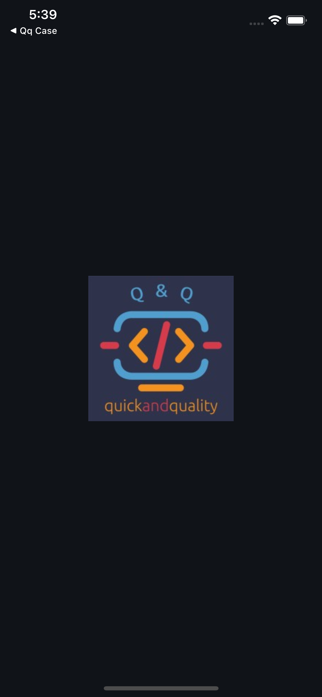
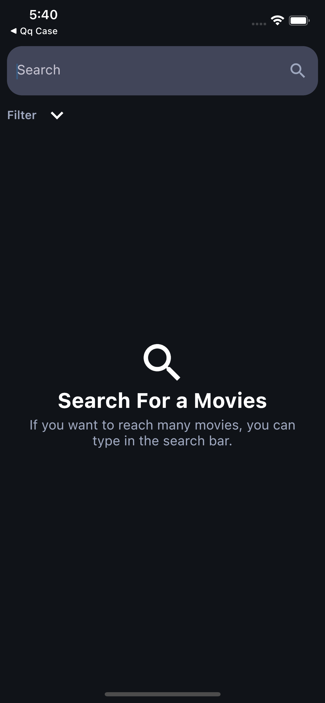
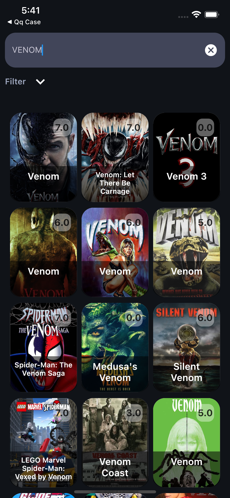
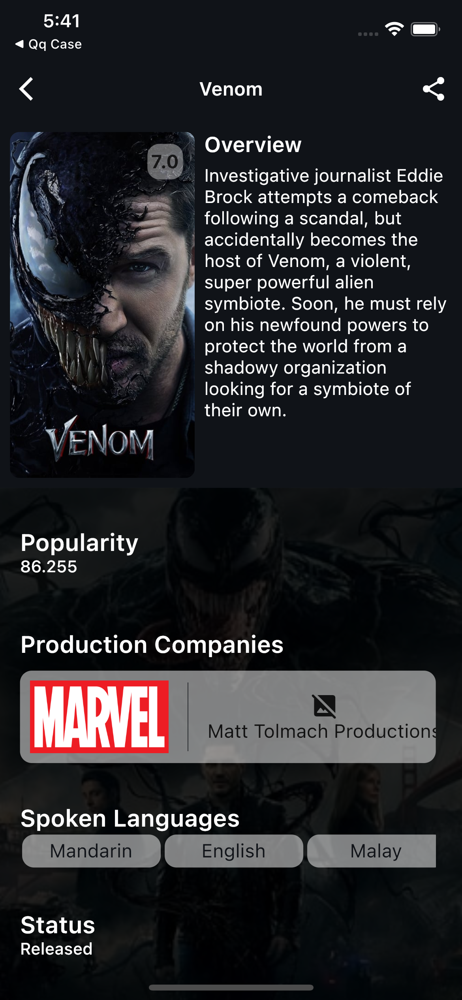

# Flutter - Mobile Case Q&Q CASE

## İlk Çalıştırma

-**Dev ortamı için**

    flutter run --target=lib/main_dev.dart --flavor=dev

-**Prod ortamı için**

    flutter run --target=lib/main_prod.dart --flavor=prod

kodlarını girerek ilk çalıştırmayı sağlayabilirsiniz.

Ana proje klasörü '.env' dosyasını oluşturun ve API anahtarını ayarlayın

ÖRNEK : API_KEY= 'xxxxxx'

## Ekran Görüntüleri

### Splash

### Search

### Movie Detail

## Neler Eklendi :question:

- [x] Splash
- [x] Search View
- [x] Movie Detail View
- [x] State Management (Provider)
- [x] Flavor

## Kullanılan Paketler

 #### Utilty
 -auto_size_text,kartal,flutter_dotenv

 #### State Management
 -provider
 
#### Network
 -dio